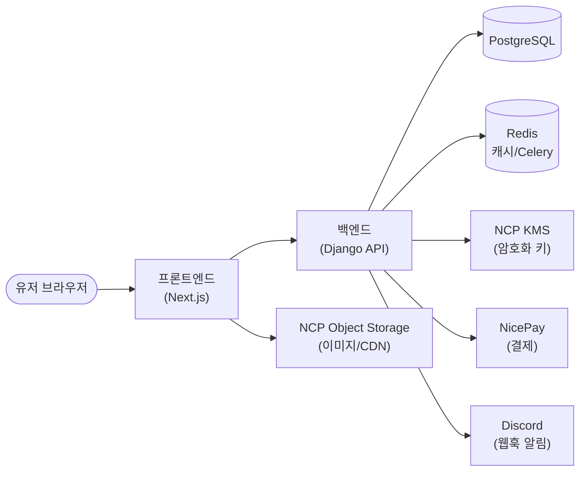
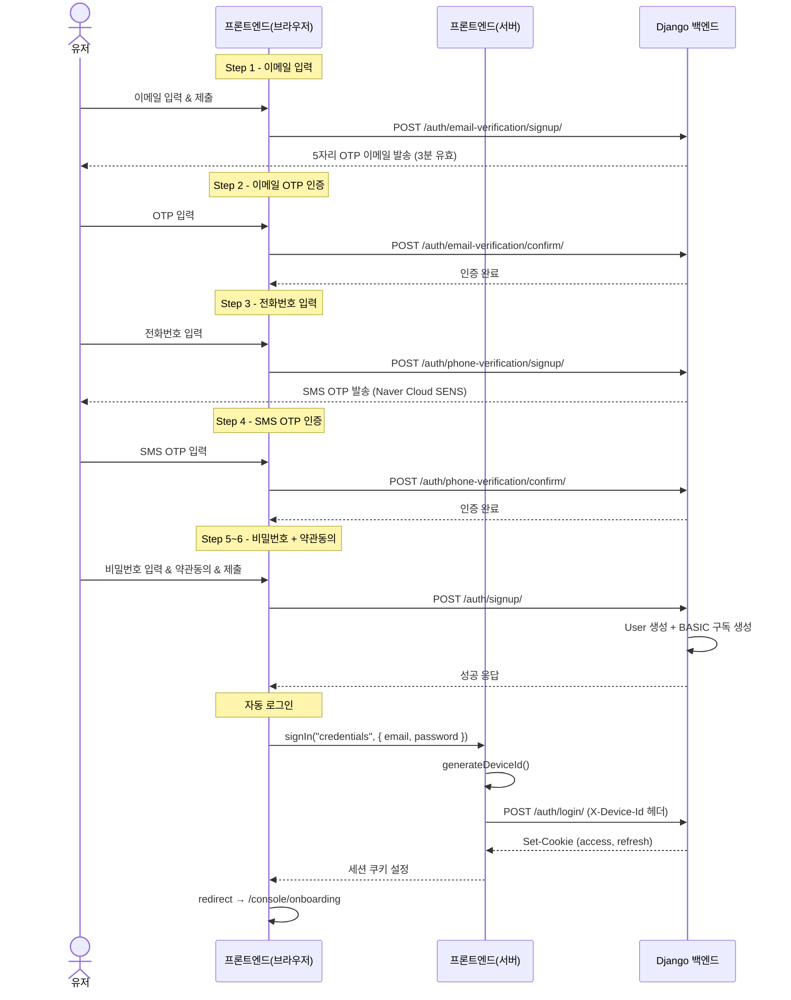
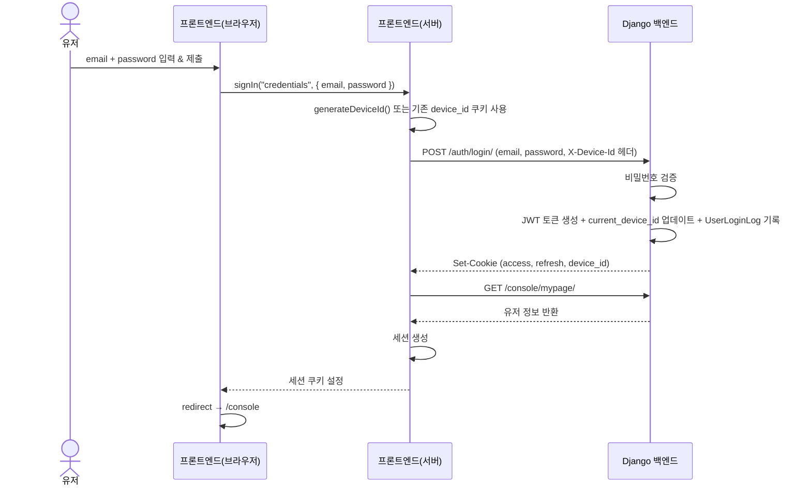
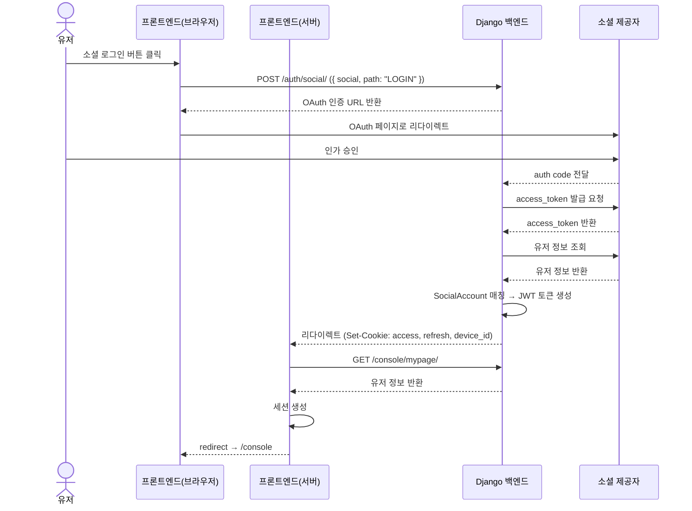
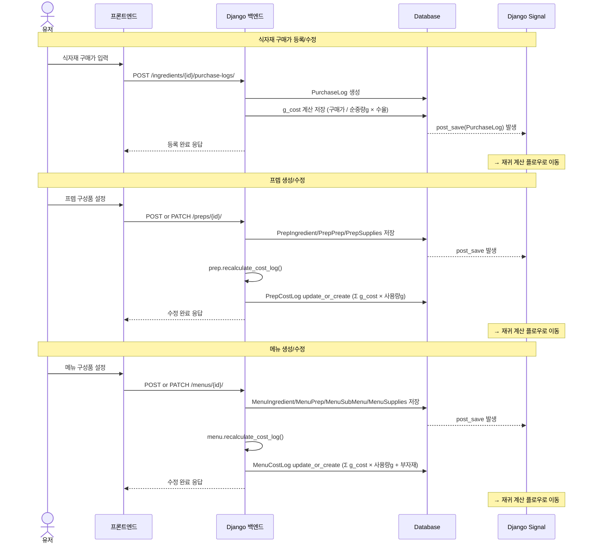
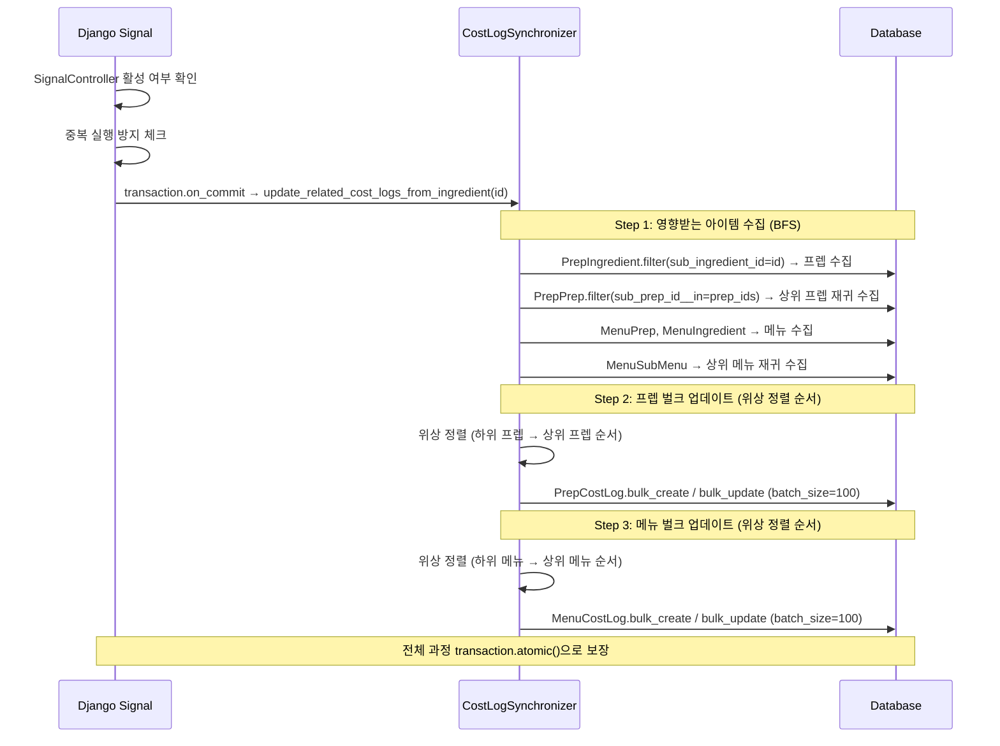
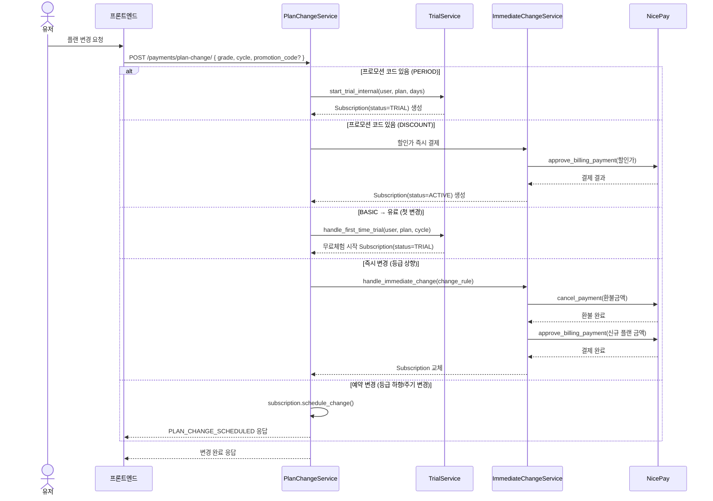
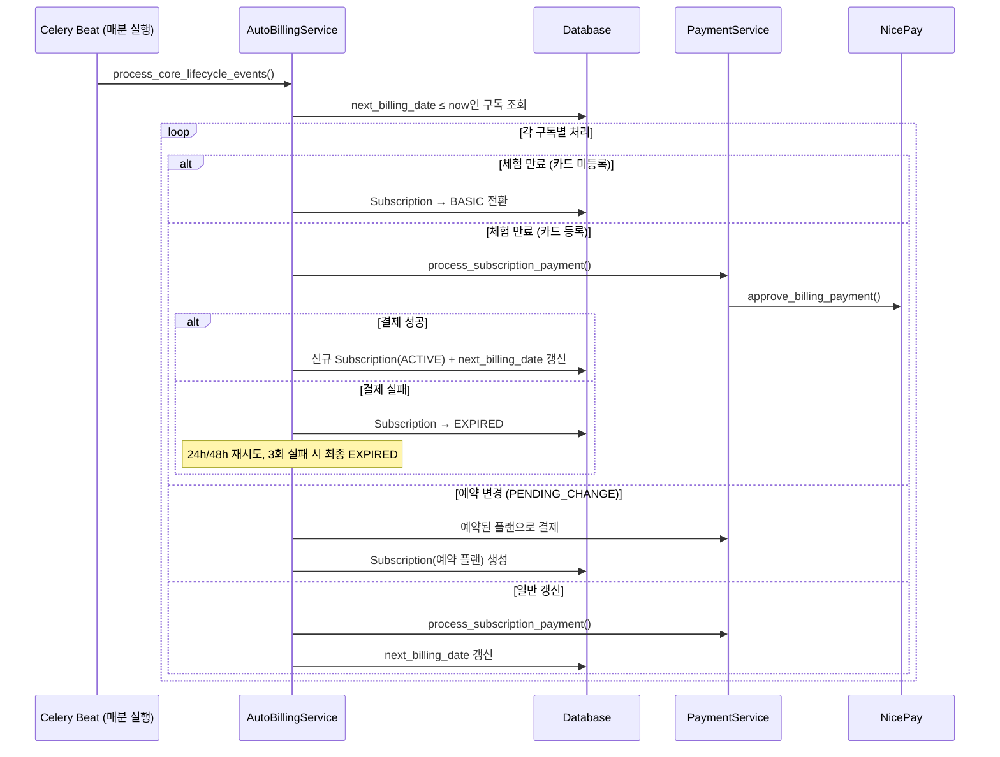

# 온보딩 콘텐츠 구현 계획

> **For agentic workers:** REQUIRED SUB-SKILL: Use superpowers:subagent-driven-development (recommended) or superpowers:executing-plans to implement this plan task-by-task. Steps use checkbox (`- [ ]`) syntax for tracking.

**Goal:** 신규 개발자 온보딩 앱의 Part 1~8 MDX 콘텐츠 파일 전체를 작성한다.

**Architecture:** `src/renderer/content/part-{N}-{slug}/` 아래 `_meta.json` + `{NN}-{slug}.mdx` 파일을 생성. Vite `import.meta.glob`이 자동 수집하므로 올바른 디렉토리·파일명 규칙만 지키면 됨. Part 1~2는 기존 파일 교체, Part 3~8은 신규 생성.

**Tech Stack:** MDX (frontmatter: title, description, type, enforce), Mermaid (시퀀스 다이어그램), 커스텀 컴포넌트 (`<Check>`, `<Head>`)

---

## 파일 구조 전체 맵

```
src/renderer/content/
├── part-1-account-check/
│   ├── _meta.json          (기존 유지)
│   └── 01-accounts.mdx     (신규 — 기존 01-github.mdx 대체)
├── part-2-env-setup/
│   ├── _meta.json          (기존 유지)
│   ├── 01-frontend.mdx     (신규)
│   └── 02-backend.mdx      (신규 — 기존 01-docker.mdx 대체)
├── part-3-dev-process/     (신규 디렉토리)
│   ├── _meta.json
│   ├── 01-overall-process.mdx
│   └── 02-dev-process.mdx
├── part-4-communication/   (신규 디렉토리)
│   ├── _meta.json
│   ├── 01-api-docs.mdx
│   ├── 02-code-convention.mdx
│   └── 03-branch-strategy.mdx
├── part-5-codebase/        (신규 디렉토리)
│   ├── _meta.json
│   ├── 01-architecture-overview.mdx
│   ├── 02-auth-system.mdx
│   ├── 03-cost-calculation.mdx
│   ├── 04-payment-plan.mdx
│   └── 05-other-domains.mdx
├── part-6-cloud/           (신규 디렉토리)
│   ├── _meta.json
│   ├── 01-current-infra.mdx
│   └── 02-future-infra.mdx
├── part-7-cicd/            (신규 디렉토리)
│   ├── _meta.json
│   ├── 01-deployment.mdx
│   └── 02-server-setup.mdx
└── part-8-monitoring/      (신규 디렉토리)
    ├── _meta.json
    ├── 01-cs-support.mdx
    ├── 02-logging.mdx
    └── 03-data-analytics.mdx
```

---

## Task 1: Part 1 — 계정 체크

**Files:**
- Delete: `src/renderer/content/part-1-account-check/01-github.mdx`
- Create: `src/renderer/content/part-1-account-check/01-accounts.mdx`

- [ ] **Step 1: 기존 파일 삭제**

```bash
rm src/renderer/content/part-1-account-check/01-github.mdx
```

- [ ] **Step 2: 01-accounts.mdx 작성**

`src/renderer/content/part-1-account-check/01-accounts.mdx`:

```mdx
---
title: 계정 체크리스트
description: 팀 협업 도구 계정 초대를 확인하고 접근 권한을 설정합니다
type: checklist
enforce: false
---

<Head title="계정 체크리스트" date="2026-04-14" description="입사 첫날 완료해야 할 계정 설정 목록" />

## 계정 체크리스트

아래 항목을 모두 완료해주세요. 초대 메일이 오지 않았거나 권한이 없다면 담당자에게 문의하세요.

<Check id="github">**GitHub** — team-foodlogic 조직 초대 수락 (이메일 확인)</Check>
<Check id="google-calendar">**Google Calendar** — 팀 공유 캘린더 구독 (담당자에게 캘린더 공유 요청)</Check>
<Check id="google-drive">**Google Drive** — 키·환경변수 공유 폴더 접근 권한 확인 (담당자에게 요청)</Check>
<Check id="discord">**Discord** — 팀 서버 참여 (초대 링크 담당자에게 요청)</Check>
<Check id="notion">**Notion** — 팀 워크스페이스 초대 수락 (이메일 확인)</Check>
<Check id="ncp">**NCP SubAccount** — Naver Cloud Platform 서브 계정 생성 (담당자에게 요청)</Check>
```

- [ ] **Step 3: 타입체크로 이상 없음 확인**

```bash
pnpm typecheck
```

Expected: 에러 없음

- [ ] **Step 4: 커밋**

```bash
git add src/renderer/content/part-1-account-check/
git commit -m "content: Part 1 계정 체크리스트 단일 페이지로 재작성"
```

---

## Task 2: Part 2 — 환경 세팅

**Files:**
- Delete: `src/renderer/content/part-2-env-setup/01-docker.mdx`
- Create: `src/renderer/content/part-2-env-setup/01-frontend.mdx`
- Create: `src/renderer/content/part-2-env-setup/02-backend.mdx`

- [ ] **Step 1: 기존 파일 삭제**

```bash
rm src/renderer/content/part-2-env-setup/01-docker.mdx
```

- [ ] **Step 2: 01-frontend.mdx 작성**

`src/renderer/content/part-2-env-setup/01-frontend.mdx`:

```mdx
---
title: 프론트엔드 개발환경 세팅
description: Node.js, pnpm 설치 후 프론트엔드 로컬 개발 서버를 실행합니다
type: mission
enforce: false
---

<Head title="프론트엔드 개발환경 세팅" date="2026-04-14" description="Node.js + pnpm + Turborepo 모노레포 환경 구성" />

## 사전 준비: Node.js + pnpm 설치

레포는 **Node.js 24.0.2** + **pnpm 10.13.1** 버전을 고정합니다.

### 1. Node.js 설치

[Node.js 공식 사이트](https://nodejs.org)에서 24.x LTS 버전을 설치하거나, `nvm`을 사용합니다.

```bash
# nvm 사용 시
nvm install 24.0.2
nvm use 24.0.2

# 버전 확인
node -v  # v24.0.2
```

### 2. pnpm 설치

```bash
npm install -g pnpm@10.13.1

# 버전 확인
pnpm -v  # 10.13.1
```

---

## 레포 클론 및 실행

```bash
git clone git@github.com:team-foodlogic/foodlogic-frontend.git
cd foodlogic-frontend
```

### 한 번에 실행 (권장)

```bash
pnpm bootstrap:dev
```

내부적으로 `pnpm install --frozen-lockfile` 후 `pnpm dev`를 실행합니다.

### 접속 주소

| 앱 | URL | 설명 |
|---|---|---|
| Client | http://localhost:3000 | 메인 유저 앱 |
| Admin | http://localhost:3100 | 관리자 대시보드 |
| Wiki | http://localhost:3200 | 내부 문서 사이트 |

---

## 모노레포 구조 요약

```
foodlogic-frontend/
├── apps/
│   ├── client/    # 유저 앱 (포트 3000)
│   ├── admin/     # 어드민 (포트 3100)
│   └── wiki/      # 위키 (포트 3200)
└── packages/
    ├── api/       # React Query 훅 + API 함수
    ├── ui/        # 공통 UI 컴포넌트 (Shadcn/Radix)
    ├── types/     # 공유 TypeScript 타입
    └── ...        # 기타 유틸리티 패키지
```

Turborepo로 관리되며, `pnpm dev`는 세 앱을 병렬로 실행합니다.

<Mission title="프론트엔드 환경 세팅 완료" description="pnpm bootstrap:dev 실행 후 localhost:3000이 정상적으로 열리면 완료" />
<MissionNote />
```

- [ ] **Step 3: 02-backend.mdx 작성**

`src/renderer/content/part-2-env-setup/02-backend.mdx`:

```mdx
---
title: 백엔드 개발환경 세팅
description: Docker Compose로 백엔드 로컬 개발환경을 실행합니다
type: mission
enforce: false
---

<Head title="백엔드 개발환경 세팅" date="2026-04-14" description="Django + PostgreSQL + Redis + Celery — Docker Compose 기반" />

## 기술 스택

| 구성요소 | 기술 |
|---|---|
| Framework | Django 5.0.6 + DRF 3.16 |
| DB | PostgreSQL 15 |
| Cache/Broker | Redis |
| Async | Celery 5.5 + Celery Beat |
| Server | Gunicorn + Nginx |
| Container | Docker Compose |

`make all` 하나로 위 전체가 실행됩니다.

---

## 세팅 절차

### 1. 레포 클론

```bash
git clone git@github.com:team-foodlogic/backend.git
cd backend
```

### 2. `.env` 파일 준비

> **.env 파일은 Google Drive 공유 폴더 또는 담당 개발자에게 공유받으세요.**
>
> Google Drive → 백엔드키 폴더 → `.env` (로컬 개발용)

파일을 레포 루트에 위치시킵니다:

```
backend/
└── .env   ← 여기
```

### 3. 빌드 및 실행

```bash
make all
```

최초 실행 시 Docker 이미지 빌드가 포함되어 수분 소요됩니다.

### 4. 암호화 키 초기화 (최초 1회)

```bash
make init-keys
```

데이터 암호화용 DEK(Data Encryption Key)를 초기화합니다. 최초 1회만 실행하면 됩니다.

### 5. 상태 확인

```bash
make ps     # 컨테이너 상태 확인
make logs   # 로그 스트림
```

서버가 정상 실행되면 `http://localhost:8000` 으로 접근 가능합니다.

---

## 주요 make 명령어

| 명령어 | 용도 |
|---|---|
| `make all` | 전체 빌드 + 실행 |
| `make ps` | 컨테이너 상태 확인 |
| `make logs` | 로그 확인 |
| `make init-keys` | DEK 초기화 (최초 1회) |
| `make migrate` | 마이그레이션 파일 생성 |
| `make makemigrations` | 마이그레이션 적용 |

<Mission title="백엔드 환경 세팅 완료" description="make all 실행 후 make ps에서 모든 컨테이너가 Up 상태이면 완료" />
<MissionNote />
```

- [ ] **Step 4: 타입체크**

```bash
pnpm typecheck
```

Expected: 에러 없음

- [ ] **Step 5: 커밋**

```bash
git add src/renderer/content/part-2-env-setup/
git commit -m "content: Part 2 환경세팅 프론트/백엔드 분리 작성"
```

---

## Task 3: Part 3 — 개발 프로세스

**Files:**
- Create: `src/renderer/content/part-3-dev-process/_meta.json`
- Create: `src/renderer/content/part-3-dev-process/01-overall-process.mdx`
- Create: `src/renderer/content/part-3-dev-process/02-dev-process.mdx`

- [ ] **Step 1: 디렉토리 생성 + _meta.json 작성**

```bash
mkdir -p src/renderer/content/part-3-dev-process
```

`src/renderer/content/part-3-dev-process/_meta.json`:

```json
{ "title": "개발 프로세스", "description": "기획부터 배포까지 전체 개발 흐름을 이해합니다" }
```

- [ ] **Step 2: 01-overall-process.mdx 작성**

`src/renderer/content/part-3-dev-process/01-overall-process.mdx`:

```mdx
---
title: 전체 개발 프로세스
description: 기획 초안부터 prod 배포까지 전체 흐름을 설명합니다
type: learn
enforce: false
---

<Head title="전체 개발 프로세스" date="2026-04-14" description="기획 → 디자인 → 일정 산정 → 개발 → QA → 배포" />

## 전체 플로우

```
기획 초안 (Notion)
    ↓
각 파트 댓글 리뷰 루프
    ↓ (완료까지 반복)
피그마 화면 설계
    ↓
리뷰 루프
    ↓ (완료까지 반복)
개발 일정 산정
    ↓
개발
    ↓
stg 배포 → 기획 QA
    ↓
prod 배포
```

---

## 단계별 상세

### 1. 기획 초안 작성 (Notion)

기획자가 Notion에 기능 초안을 작성합니다. 각 파트 담당자(개발, 디자인 등)가 댓글로 리뷰하고, 피드백이 반영될 때까지 루프를 반복합니다.

### 2. 피그마 화면 설계

기획이 완료되면 디자이너가 Figma로 화면을 설계합니다. 마찬가지로 리뷰 루프를 통해 완료 승인을 받습니다.

### 3. 개발 일정 산정

피그마가 완료되는 그 자리에서 바로 일정을 산정합니다.

- 백엔드 / 프론트엔드 각각 독립적으로 산정
- **stg 완료 목표일** 확정
- stg 완료 후 **prod 예상 배포일** 산정

### 4. 개발

각자 개발 후 개발 QA → stg 배포 → 기획 QA → prod 배포. 상세 내용은 [개발자 프로세스](/part-3-dev-process/02-dev-process) 문서를 참고하세요.

### 5. QA 및 배포

| 단계 | 담당 | 환경 |
|---|---|---|
| 개발 QA | 개발자 | local/stg |
| 기획 QA | 기획자 | stg |
| prod 배포 | 개발자 | prod |
```

- [ ] **Step 3: 02-dev-process.mdx 작성**

`src/renderer/content/part-3-dev-process/02-dev-process.mdx`:

```mdx
---
title: 개발자 프로세스
description: 개발자 간 실무 프로세스와 규칙을 설명합니다
type: learn
enforce: false
---

<Head title="개발자 프로세스" date="2026-04-14" description="API 설계 → 개발 → QA → 배포 흐름과 팀 규칙" />

## 개발 플로우

```
피그마 완료 → 그 자리에서 일정 산정 (stg 목표일 확정)
    ↓
API 구조 설계 회의 (네이밍, 큰 그림)
    ↓
백엔드: API 명세서 작성 및 전달 (llms.txt 방식)
    ↓
백엔드 / 프론트엔드 각자 개발
    ↓
개발 QA (개발자끼리)
    ↓
stg 배포
    ↓
기획 QA
    ↓
prod 배포
```

---

## 규칙 및 관례

### API 설계 회의

피그마가 완료되면 백/프론트가 함께 API 구조를 먼저 논의합니다. 이 단계에서는 엔드포인트 네이밍과 전체 구조를 결정하고, 상세 스펙(필드 타입, 예제 등)은 백엔드가 명세서를 작성하면서 확정합니다.

### API 명세서 전달

백엔드가 로컬 서버를 실행하면 `http://localhost:8000/llms.txt` 경로로 API 명세서에 접근할 수 있습니다. 프론트는 이 경로를 AI 도구에 읽혀서 개발에 활용합니다. 자세한 내용은 [API 문서](/part-4-communication/01-api-docs)를 참고하세요.

### Task 관리

모든 개발 Task는 **Notion**에서 관리합니다.

### PR 및 코드 리뷰

현재 프론트엔드/백엔드 각 1명으로 운영 중입니다. 각자 PR을 생성하고 직접 머지합니다.

### 배포 금지 규칙

> ⚠️ **다음날 쉬는 날(공휴일, 주말)이 있는 경우 금요일 배포는 금지합니다.**

버그가 발생해도 즉시 대응이 어렵기 때문입니다.
```

- [ ] **Step 4: 타입체크**

```bash
pnpm typecheck
```

Expected: 에러 없음

- [ ] **Step 5: 커밋**

```bash
git add src/renderer/content/part-3-dev-process/
git commit -m "content: Part 3 개발 프로세스 추가"
```

---

## Task 4: Part 4 — 커뮤니케이션 / 문서

**Files:**
- Create: `src/renderer/content/part-4-communication/_meta.json`
- Create: `src/renderer/content/part-4-communication/01-api-docs.mdx`
- Create: `src/renderer/content/part-4-communication/02-code-convention.mdx`
- Create: `src/renderer/content/part-4-communication/03-branch-strategy.mdx`

- [ ] **Step 1: 디렉토리 생성 + _meta.json 작성**

```bash
mkdir -p src/renderer/content/part-4-communication
```

`src/renderer/content/part-4-communication/_meta.json`:

```json
{ "title": "개발 커뮤니케이션 / 문서", "description": "API 문서, 코드 컨벤션, 브랜치 전략을 설명합니다" }
```

- [ ] **Step 2: 01-api-docs.mdx 작성**

`src/renderer/content/part-4-communication/01-api-docs.mdx`:

```mdx
---
title: API 문서
description: API 명세서 관리 방식과 응답 규격을 설명합니다
type: learn
enforce: false
---

<Head title="API 문서" date="2026-04-14" description="llms.txt 기반 AI-friendly API 명세 시스템" />

## 현재 방식: llms.txt

백엔드가 AI 친화적인 MD 문서를 자동 생성합니다. 로컬 백엔드 서버(`localhost:8000`)를 실행하면 접근 가능합니다.

| 경로 | 내용 |
|---|---|
| `GET /llms.txt` | 목차 — 전체 API URL과 한 줄 설명 |
| `GET /llms.txt?path=/api/xxx/` | 특정 API 상세 문서 (요청/응답 예제 포함) |

### 프론트엔드에서 활용하는 방법

1. 백엔드 로컬 서버 실행 (`make all`)
2. AI 도구(Claude, Cursor 등)에 `http://localhost:8000/llms.txt` 경로를 전달
3. AI가 해당 문서를 읽고 API 정보를 기반으로 개발 지원

---

## 구 방식: Notion (참고용)

과거에는 Notion에 API 명세서를 수기로 작성했습니다. 현재는 사용하지 않습니다.

---

## API 응답 규격

모든 API는 아래 형식을 따릅니다.

### 기본 응답

```json
{
  "code": "SUCCESS",
  "message": "string or null",
  "data": {}
}
```

- `code`: 결과 구분값. 성공 시 대체로 `"SUCCESS"` 고정
- `message`: 필요 시 문자열 반환, 없으면 `null`
- `data`: 실제 데이터

### 페이지네이션 응답

```json
{
  "code": "SUCCESS",
  "message": null,
  "data": {
    "page": 1,
    "total_page": 5,
    "page_size": 20,
    "items": []
  }
}
```
```

- [ ] **Step 3: 02-code-convention.mdx 작성**

`src/renderer/content/part-4-communication/02-code-convention.mdx`:

```mdx
---
title: 코드 컨벤션
description: 팀의 코드 스타일 가이드를 설명합니다
type: learn
enforce: false
---

<Head title="코드 컨벤션" date="2026-04-14" description="프론트엔드 코드 스타일 및 구조 가이드" />

## 원칙

별도로 강제하는 공통 컨벤션은 없습니다. 각자의 스타일을 유지하되, 기존 코드의 패턴을 따르는 것을 권장합니다.

---

## 프론트엔드 가이드 문서

프론트엔드 레포 `docs/` 폴더에 상세 가이드가 있습니다.

| 문서 | 내용 |
|---|---|
| `docs/architecture.md` | 모노레포 구조, 기술 스택, 환경별 API 엔드포인트 |
| `docs/feature-structure.md` | feature 모듈 구조, 폴더 역할, 파일 네이밍 규칙 |
| `docs/component-conventions.md` | 컴포넌트 작성 규칙 |
| `docs/state-management.md` | Jotai(전역 UI 상태) + React Query(서버 상태) 사용 패턴 |
| `docs/api-patterns.md` | API 호출 패턴 |
| `docs/routing.md` | Next.js App Router 라우팅 구조 |

> 새 기능 개발 전에 `feature-structure.md`를 먼저 읽어보세요. feature 모듈 구조가 통일되어 있습니다.
```

- [ ] **Step 4: 03-branch-strategy.mdx 작성**

`src/renderer/content/part-4-communication/03-branch-strategy.mdx`:

```mdx
---
title: 브랜치 전략
description: 팀의 Git 브랜치 관리 방식을 설명합니다
type: learn
enforce: false
---

<Head title="브랜치 전략" date="2026-04-14" description="main / stg / dev 3단계 브랜치 전략" />

## 브랜치 구조

```
main  ←── stg  ←── dev  ←── feat/[name]
(prod)   (staging)  (개발 공유)  (개인 작업)
```

| 브랜치 | 서버 | 설명 |
|---|---|---|
| `main` | prod | 운영 서버. 직접 push 금지 |
| `stg` | staging | 기획 QA용 스테이징 서버 |
| `dev` | — | 개발자 간 실시간 공유 버전 |
| `feat/[name]` | — | 개인 작업 브랜치 (선택적) |

---

## 규칙

### dev 브랜치

> ⚠️ **dev에 push할 때는 항상 동작하는 상태여야 합니다.**

프론트/백엔드 모두 `dev`를 pull해서 최신 상태를 공유합니다. 깨진 상태로 push하면 다른 개발자 작업에 즉시 영향을 줍니다.

개인 작업이 완료되지 않았다면 `feat/[name]` 브랜치를 분기해서 작업하고, 완료 후 `dev`에 머지하세요.

### feat/[name] 브랜치 (선택)

```bash
git checkout -b feat/login-page   # dev에서 분기
# ... 작업 ...
git checkout dev
git merge feat/login-page
```

필수는 아닙니다. 완료가 확실한 작은 작업은 `dev`에서 바로 작업해도 됩니다.

### stg 배포

`dev`에서 개발 QA가 완료되면 `stg`에 머지 후 스테이징 서버에 배포합니다.

### hotfix

긴급 수정이 필요한 경우 `stg` 또는 `main`에서 직접 브랜치를 분기합니다.

```bash
git checkout -b hotfix/payment-bug main
# ... 수정 ...
git checkout main
git merge hotfix/payment-bug
git checkout stg
git merge hotfix/payment-bug
```
```

- [ ] **Step 5: 타입체크**

```bash
pnpm typecheck
```

Expected: 에러 없음

- [ ] **Step 6: 커밋**

```bash
git add src/renderer/content/part-4-communication/
git commit -m "content: Part 4 커뮤니케이션/문서 추가"
```

---

## Task 5: Part 5 — 아키텍처 개요

**Files:**
- Create: `src/renderer/content/part-5-codebase/_meta.json`
- Create: `src/renderer/content/part-5-codebase/01-architecture-overview.mdx`

- [ ] **Step 1: 디렉토리 생성 + _meta.json 작성**

```bash
mkdir -p src/renderer/content/part-5-codebase
```

`src/renderer/content/part-5-codebase/_meta.json`:

```json
{ "title": "코드 - 어플리케이션단", "description": "서비스 아키텍처와 핵심 비즈니스 로직을 이해합니다" }
```

- [ ] **Step 2: 01-architecture-overview.mdx 작성**

`src/renderer/content/part-5-codebase/01-architecture-overview.mdx`:

```mdx
---
title: 아키텍처 개요
description: 프론트엔드·백엔드 레이어 구조와 도메인 분류를 설명합니다
type: learn
enforce: false
---

<Head title="아키텍처 개요" date="2026-04-14" description="프론트 모노레포 + 백엔드 Django 도메인 구조" />

## 전체 시스템 플로우



---

## 프론트엔드 레이어 구조

**Turborepo 모노레포** — `apps/` (실행 가능한 앱) + `packages/` (공유 패키지)

| 레이어 | 위치 | 역할 |
|---|---|---|
| 라우팅 | `apps/client/src/app/` | Next.js App Router, page.tsx |
| 페이지 | `features/*/page/` | 진입점, 훅에서 데이터 받아 UI에 전달 |
| 비즈니스 로직 | `features/*/hook/` | API 호출, 상태 관리, 계산 로직 |
| UI (표현) | `features/*/ui/` | props만 받아 렌더링, 비즈니스 로직 없음 |
| 서버 상태 | `packages/api/` | TanStack React Query 훅 + Axios API 함수 |
| 전역 UI 상태 | `store/*.atom.ts` | Jotai atoms |
| 공유 컴포넌트 | `packages/ui/` | Shadcn/Radix 기반 컴포넌트 라이브러리 |
| 공유 타입 | `packages/types/` | 프론트/백 공유 TypeScript 타입 |

### 앱별 역할

| 앱 | 포트 | 설명 |
|---|---|---|
| `apps/client/` | 3000 | 메인 유저 앱 (식자재·메뉴·원가 관리) |
| `apps/admin/` | 3100 | 내부 운영팀 어드민 대시보드 |
| `apps/wiki/` | 3200 | 내부 문서 사이트 (Astro) |

---

## 백엔드 도메인 구조

**Django** — 기능별 앱으로 도메인 분리

| Django 앱 | 역할 |
|---|---|
| `users` | 유저 생성, 인증(JWT), 소셜 로그인 |
| `stores` | 매장 관리 |
| `ingredients` | 식자재 |
| `supplies` | 부자재 |
| `prep` | 프렙 (반조리) |
| `menu` | 메뉴 |
| `recipe` | 레시피, 조리 매뉴얼 |
| `finances` | 매출 분석, 메뉴 판매 데이터 |
| `payments` | 구독, 플랜, 결제 처리 |
| `nicepay` | NicePay 연동, 빌링키, PlanChangeEngine |
| `security` | DEK 기반 필드 암호화 |
| `console` | 어드민 페이지 API |
| `common` | 공통 유틸리티, 기본 모델 |

---

## 환경별 API 엔드포인트

| 환경 | URL |
|---|---|
| local | `http://localhost:8000/` |
| staging | `https://stagingapi.foodlogic.co.kr/` |
| prod | `https://api.foodlogic.co.kr/` |

환경 구분: `NEXT_PUBLIC_APP_ENV` 환경변수 → `apps/client/src/config/config.ts`
```

- [ ] **Step 3: 타입체크**

```bash
pnpm typecheck
```

Expected: 에러 없음

- [ ] **Step 4: 커밋**

```bash
git add src/renderer/content/part-5-codebase/
git commit -m "content: Part 5-1 아키텍처 개요 추가"
```

---

## Task 6: Part 5 — 계정/인증 시스템

**Files:**
- Create: `src/renderer/content/part-5-codebase/02-auth-system.mdx`

- [ ] **Step 1: 02-auth-system.mdx 작성**

`src/renderer/content/part-5-codebase/02-auth-system.mdx`:

```mdx
---
title: 계정/인증 시스템
description: JWT 토큰 구조, Device ID, 회원가입/로그인 플로우를 설명합니다
type: learn
enforce: false
---

<Head title="계정/인증 시스템" date="2026-04-14" description="JWT 토큰 로테이션 + 단일 기기 로그인 + 이메일/소셜 인증" />

## 토큰 구조

| 항목 | 내용 |
|---|---|
| 발급 토큰 | Access Token (JWT) + Refresh Token (JWT) |
| Access Token 유효기간 | 30분 |
| Refresh Token 유효기간 | 14일 |
| 저장 방식 | HTTP-only 쿠키 (`secure=True`, `samesite=Lax`) |
| 토큰 갱신 | `POST /token/refresh/` → 새 Access + 새 Refresh (토큰 로테이션) |
| 비밀번호 해싱 | Argon2 |

### 보안 메커니즘

- **토큰 로테이션:** Refresh 시 기존 토큰 블랙리스트 처리 + 새 토큰 발급
- **동시성 보호:** Redis 락으로 refresh 토큰 race condition 방지
- **재사용 방지:** 5분 내 동일 토큰 재사용 캐시 체크
- **로그아웃:** refresh 토큰 블랙리스트 + Device ID 초기화

---

## Device ID (단일 기기 로그인)

로그인 시 `X-Device-Id` 헤더 값을 `User.current_device_id`에 저장합니다. 다른 기기에서 로그인하면 기존 Device ID가 교체되어 이전 기기는 강제 로그아웃됩니다.

---

## 이메일 회원가입 플로우



---

## 이메일 로그인 플로우



---

## 소셜 로그인 플로우 (Kakao / Naver / Google)



> 신규 유저(소셜 회원가입)의 경우 추가 정보 입력(전화번호 인증, 약관동의) 단계가 포함됩니다.
```

- [ ] **Step 2: 타입체크**

```bash
pnpm typecheck
```

Expected: 에러 없음

- [ ] **Step 3: 커밋**

```bash
git add src/renderer/content/part-5-codebase/02-auth-system.mdx
git commit -m "content: Part 5-2 계정/인증 시스템 추가"
```

---

## Task 7: Part 5 — 원가계산 비즈니스 로직

**Files:**
- Create: `src/renderer/content/part-5-codebase/03-cost-calculation.mdx`

- [ ] **Step 1: 03-cost-calculation.mdx 작성**

`src/renderer/content/part-5-codebase/03-cost-calculation.mdx`:

```mdx
---
title: 원가계산 비즈니스 로직
description: 식자재→프렙→메뉴로 이어지는 원가 계산 시스템을 설명합니다
type: learn
enforce: false
---

<Head title="원가계산 비즈니스 로직" date="2026-04-14" description="DAG 구조 + Django Signal 기반 재귀 원가 전파" />

## 아이템 계층 구조

FoodLogic의 핵심 도메인입니다. 아이템은 4종류이며 계층을 이룹니다.

| 아이템 | 레이어 | 설명 |
|---|---|---|
| 식자재 (Ingredient) | Layer 0 | 원재료 |
| 부자재 (Supplies) | Layer 0 | 포장재 등 비원가 자재 |
| 프렙 (Prep) | Layer 1 | 반조리품. 식자재/부자재/프렙을 포함 가능 |
| 메뉴 (Menu) | Layer 2 | 최종 메뉴. 모든 아이템을 포함 가능 |

### 포함 관계

| 부모 \ 자식 | 식자재 | 부자재 | 프렙 | 메뉴 |
|---|---|---|---|---|
| **프렙** | O | O | O (재귀) | X |
| **메뉴** | O | O | O | O (재귀) |

```
┌──────────────────────────────────────┐
│  메뉴 (Menu) — 같은 종류 포함 가능    │
│                                      │
│  ┌────────────────────────────────┐  │
│  │  프렙 (Prep) — 같은 종류 포함 가능│ │
│  │                                │  │
│  │  ┌──────────┐  ┌──────────┐   │  │
│  │  │  식자재   │  │  부자재   │   │  │
│  │  └──────────┘  └──────────┘   │  │
│  └────────────────────────────────┘  │
└──────────────────────────────────────┘
```

이 구조는 **DAG(Directed Acyclic Graph)** 형태입니다. 하나의 식자재가 여러 프렙/메뉴에 포함될 수 있습니다.

---

## g_cost 계산식

```
g_cost = 구매가 / (순중량g × 수율)
```

`g_cost`는 1g당 비용입니다. 식자재의 구매가와 순중량, 수율을 기반으로 계산됩니다.

---

## 아이템 등록/수정 플로우



---

## 재귀 원가 전파

하위 아이템이 변경되면 이를 포함하는 **모든 상위 아이템의 원가가 자동으로 재계산**됩니다.

### 전파 경로

```
식자재 변경 → 프렙 → 상위 프렙 → 메뉴 → 상위 메뉴
부자재 변경 → 메뉴 → 상위 메뉴
프렙 변경   → 상위 프렙 → 메뉴 → 상위 메뉴
메뉴 변경   → 상위 메뉴
```

### 재귀 전파 구현



---

## unLinked 아이템

상위 아이템(A)에 포함된 하위 아이템(B)을 따로 삭제하면, A의 중량·원가를 유지하기 위해 `is_unlinked=True` 상태의 대체 아이템이 A에 남습니다. 이 아이템은 수정 불가, 삭제만 가능합니다.

> **왜?** B가 산출량 % 대신 직접 중량(예: 500g)으로 입력된 경우, B 삭제 후 A의 나머지 구성품 합계(예: 300g)가 500g보다 적어지는 오류를 방지합니다.
```

- [ ] **Step 2: 타입체크**

```bash
pnpm typecheck
```

Expected: 에러 없음

- [ ] **Step 3: 커밋**

```bash
git add src/renderer/content/part-5-codebase/03-cost-calculation.mdx
git commit -m "content: Part 5-3 원가계산 비즈니스 로직 추가"
```

---

## Task 8: Part 5 — 결제/플랜 시스템

**Files:**
- Create: `src/renderer/content/part-5-codebase/04-payment-plan.mdx`

- [ ] **Step 1: 04-payment-plan.mdx 작성**

`src/renderer/content/part-5-codebase/04-payment-plan.mdx`:

```mdx
---
title: 결제/플랜 시스템
description: 플랜 구조, 변경 규칙, NicePay 빌링키 결제 플로우를 설명합니다
type: learn
enforce: false
---

<Head title="결제/플랜 시스템" date="2026-04-14" description="NicePay 빌링키 방식 자동결제 + 플랜 변경/환불/프로모션" />

## 플랜 구조

| 등급 | 월간 | 연간 | 비고 |
|---|---|---|---|
| BASIC | 0원 | — | 기본 무료 플랜 |
| PRO | 19,800원 | 178,200원 | 연간 정가 237,600원 |
| BUSINESS | 33,000원 | 297,000원 | 연간 정가 396,000원 |

### 플랜 상태

`active` / `trial` / `suspended` / `cancelled` / `expired` / `pending_change`

### 등급별 리소스 제한

| 항목 | BASIC | PRO | BUSINESS |
|---|---|---|---|
| 매장 | 1 | 3 | 10 |
| 식자재 | 50 | 500 | 1,500 |
| 부자재 | 5 | 100 | 300 |
| 프렙 | 10 | 50 | 150 |
| 메뉴 | 10 | 50 | 150 |
| 조리 매뉴얼 | 0 | 50 | 150 |

---

## 프로모션 유형

| 유형 | 설명 |
|---|---|
| PERIOD | N일 무료 체험 → 종료 시 정가 자동결제 |
| DISCOUNT | 즉시 할인 결제 → N회 할인 → 소진 후 정가 |
| MIXED | N일 무료 → 할인 결제 → M회 할인 → 정가 |

할인 방식: `FLAT`(정액) / `RATE`(정률) / `FIXED_PRICE`(고정금액)

---

## 플랜 변경 규칙

> 핵심 요약: 등급 상향(PRO→BUSINESS)은 즉시 + 환불. 등급 하향/주기 변경은 예약. 체험→변경은 즉시 + 환불 없음.

| 현재 플랜 | 변경 대상 | 처리 방식 | 환불 |
|---|---|---|---|
| BASIC | PRO/BUSINESS | 즉시 | 없음 (첫 변경 시 무료체험) |
| PRO 월간 | BUSINESS 월간/연간 | 즉시 | 일할 환불 |
| PRO 월간 | PRO 연간 / BASIC | 예약 | 없음 |
| PRO 연간 | BUSINESS | 즉시 | 일할/할인가 기준 환불 |
| PRO 연간 | PRO 월간 / BASIC | 예약 | 없음 |
| BUSINESS 월간/연간 | 하향 | 예약 | 없음 |
| 체험 중 | 상위 플랜 | 즉시 | 없음 |
| 구독 취소 | BASIC | 즉시 | 일할 환불 |

---

## 유저 결제 플로우



---

## 자동결제 플로우 (Celery Beat)



---

## 주의사항

- 결제 실패 시 BASIC 다운그레이드가 아닌 **EXPIRED 처리** (데이터 보존, 재결제 유도)
- 환불 금액은 **원래 결제 금액 기준** 일할 계산 (단, 연간→연간은 할인가 기준)
- **NicePay에서 직접 환불 금지** — 반드시 Admin 페이지에서 환불 (기록 유지 필수)
- 모든 결제/환불/실패는 **Discord 웹훅** 알림 발송
- `PlanManagementLog`로 모든 구독 상태 변화를 Admin에서 추적 가능

---

## 결제 서비스 모듈

| 서비스 | 역할 |
|---|---|
| `BillingKeyService` | 카드 등록/삭제 |
| `PaymentService` | 결제 실행 + 할인 반영 |
| `PaymentPageService` | 8가지 시나리오별 결제 페이지 응답 |
| `PromotionService` | 프로모션 검증/적용 |
| `TrialService` | 무료체험 시작/취소/연장 |
| `AutoBillingService` | 자동결제 + 갱신 |
| `PlanChangeService` | 플랜 변경 오케스트레이터 |
```

- [ ] **Step 2: 타입체크**

```bash
pnpm typecheck
```

Expected: 에러 없음

- [ ] **Step 3: 커밋**

```bash
git add src/renderer/content/part-5-codebase/04-payment-plan.mdx
git commit -m "content: Part 5-4 결제/플랜 시스템 추가"
```

---

## Task 9: Part 5 — 기타 도메인

**Files:**
- Create: `src/renderer/content/part-5-codebase/05-other-domains.mdx`

- [ ] **Step 1: 05-other-domains.mdx 작성**

`src/renderer/content/part-5-codebase/05-other-domains.mdx`:

```mdx
---
title: 기타 도메인
description: 레시피, 매출 분석, 데이터 암호화, 어드민 페이지를 설명합니다
type: learn
enforce: false
---

<Head title="기타 도메인" date="2026-04-14" description="레시피 / 매출 분석 / 봉투 암호화 / 어드민" />

## 레시피

- `Recipe` 모델이 Menu 또는 Prep과 **1:1 관계** (둘 중 하나만 연결)
- `RecipeStep`으로 조리 순서 관리 (order 필드, 이미지 선택 첨부)
- 레시피는 첫 스텝 생성 시 자동 생성 (on-demand)
- 스텝 수정은 PUT으로 전체 교체 (atomic transaction)
- 삭제는 soft delete (`is_active=False`)
- **플랜 제한:** BASIC 0개, PRO 50개, BUSINESS 150개

| 메서드 | 경로 | 용도 |
|---|---|---|
| GET/PATCH | `/recipe/menu/{menu_id}/` | 메뉴 레시피 조회/수정 |
| GET/POST/PUT/DELETE | `/recipe/menu/{menu_id}/steps/` | 메뉴 레시피 스텝 CRUD |

---

## 매출 분석

- `MenuSales` 모델에 메뉴별 월간 판매량을 JSONField로 저장
- **공헌이익** = `(세전판매가 × 판매량) - (component_cost × 판매량)`
- 원가 로그가 해당 월에 없으면 가장 가까운 미래 월 원가로 대체(backfill)
- 미래 월에는 양수 판매량 입력 불가

| 메서드 | 경로 | 용도 |
|---|---|---|
| GET | `/finances/menu-sales/?year=2025` | 연도별 판매량 조회 |
| POST | `/finances/menu-sales/` | 판매량 벌크 저장 |
| GET | `/finances/menu-analysis/?startdate=2025-05&enddate=2025-05` | 수익성 분석 |

---

## 데이터 암호화 (봉투 암호화)

민감 데이터(전화번호, 자재명 등)를 **2계층 키 관리**로 암호화합니다.

### 아키텍처

| 계층 | 키 종류 | 저장 위치 | 역할 |
|---|---|---|---|
| 1계층 | Master Key (KEK) | NCP KMS | DEK를 암호화/복호화 |
| 2계층 | Data Encryption Key (DEK) | DB `encryption_keys` 테이블 | 실제 데이터 암호화/복호화 |

- 암호화 알고리즘: **AES-256-GCM**
- DEK는 Redis에 1일 캐싱 → KMS 호출 비용 최소화

### 봉투 암호화를 선택한 이유

1. NCP KMS 호출 비용 절감 (Redis 캐싱으로 1일 1회)
2. DB 탈취 시 복호화 어려움 (KMS 키 없이는 DEK 복호화 불가)

### 암호화 대상 필드

| 모델 | 필드 | 비고 |
|---|---|---|
| User | `phone_number` | Blind Index 포함 |
| Ingredient | `description` | — |
| Item | `name` | — |
| Recipe | `description` | — |

---

## 어드민 페이지

내부 운영팀용 대시보드 (`apps/admin/`, 포트 3100)

### 주요 기능

| 기능 | 설명 |
|---|---|
| 대시보드 | 시계열 지표 실시간 계산, 블랙리스트 계정 자동 필터링 |
| 유저 관리 | 유저 정보, 플랜 이력, 결제 이력, 로그인 패턴, 탈퇴 관리 |
| 프로모션 | 프로모션 발급 및 사용 내역 추적 |
| Django Admin | `api.foodlogic.co.kr/django-admin/` (사무소 IP에서만 접속 가능) |

---

## 기타 기능

- **온보딩 설문:** 회원가입 후 매장 생성 유도 및 초기 설문
- **매장 관리:** 다중 매장, 플랜별 매장 수 제한
- **마이페이지:** 유저 정보, 구독 플랜 확인
- **자재 데이터:** 삼성 웰스토리 데이터 가공 후 DB에 등록 (`wellstory.tsv`)
- **버전 관리:** 프론트/백 각각 관리, 릴리즈 시 통합 버전 별도 관리 (유저 영향 있는 변경만 버전업)
```

- [ ] **Step 2: 타입체크**

```bash
pnpm typecheck
```

Expected: 에러 없음

- [ ] **Step 3: 커밋**

```bash
git add src/renderer/content/part-5-codebase/05-other-domains.mdx
git commit -m "content: Part 5-5 기타 도메인 추가"
```

---

## Task 10: Part 6 — 클라우드

**Files:**
- Create: `src/renderer/content/part-6-cloud/_meta.json`
- Create: `src/renderer/content/part-6-cloud/01-current-infra.mdx`
- Create: `src/renderer/content/part-6-cloud/02-future-infra.mdx`

- [ ] **Step 1: 디렉토리 + _meta.json 작성**

```bash
mkdir -p src/renderer/content/part-6-cloud
```

`src/renderer/content/part-6-cloud/_meta.json`:

```json
{ "title": "클라우드", "description": "NCP 기반 인프라 현황과 확장 방향을 설명합니다" }
```

- [ ] **Step 2: 01-current-infra.mdx 작성**

`src/renderer/content/part-6-cloud/01-current-infra.mdx`:

```mdx
---
title: 현재 인프라 (NCP)
description: 현재 사용 중인 Naver Cloud Platform 서비스 목록을 설명합니다
type: learn
enforce: false
---

<Head title="현재 인프라 (NCP)" date="2026-04-14" description="Naver Cloud Platform 기반 인프라 전체 구성" />

## 사용 중인 NCP 서비스

| 서비스 | 용도 | 비고 |
|---|---|---|
| **Server** | stg + prod 서버 각 1대 | Ubuntu, Docker Compose로 운영 |
| **Cloud DB for PostgreSQL** | prod DB | local/stg는 Docker 내부 DB 사용 |
| **Object Storage** | 이미지 파일 저장 | AWS S3 호환 |
| **Cloud Outbound Mailer** | 계정/결제 이메일 발송 | 회원가입 OTP, 결제 실패 등 |
| **KMS (Key Management Service)** | 데이터 암호화 마스터 키 | DEK 암호화/복호화용 |
| **ELSA** | 로그 수집·검색·분석 | 백엔드 애플리케이션 로그 |
| **WMS (Web Service Monitoring)** | 헬스체크 | `/health/` 10분마다 체크 |
| **Sub Account** | NCP IAM | 최소 권한 계정 키 관리 |

---

## Object Storage 버킷 목록

| 버킷 | 용도 |
|---|---|
| `foodlogic-bucket` | prod 유저 데이터 (이미지 등) |
| `test-foodlogic-bucket` | stg 유저 데이터 |
| `foodlogic-logs` | ELSA 로그 백업 |
| `foodlogic-assets` | 랜딩 페이지 이미지 (프론트 사용) |

---

## DB 환경별 구성

| 환경 | DB |
|---|---|
| local | Docker 내부 PostgreSQL 15 |
| staging | Docker 내부 PostgreSQL 15 |
| prod | NCP Cloud DB for PostgreSQL |

### 마이그레이션

배포 시 자동으로 마이그레이션이 적용됩니다 (`make all`, `make staging`, `make prod`). 별도로 실행할 필요가 없습니다.

---

## NCP Sub Account (= AWS IAM)

서비스별로 최소 권한만 부여한 계정 키를 사용합니다.

예: Object Storage에만 접근 가능한 키를 별도 생성해서 백엔드 `.env`에 설정.

Part 1에서 담당자에게 Sub Account 생성을 요청해야 하는 이유입니다.
```

- [ ] **Step 3: 02-future-infra.mdx 작성**

`src/renderer/content/part-6-cloud/02-future-infra.mdx`:

```mdx
---
title: 앞으로 알아야 할 인프라
description: 트래픽 증가 시 확장을 위해 알아두어야 할 NCP 서비스를 소개합니다
type: learn
enforce: false
---

<Head title="앞으로 알아야 할 인프라" date="2026-04-14" description="현재 단순 구조에서 확장 시 필요한 NCP 서비스들" />

## 현재 구조의 한계

현재는 stg/prod 각각 단일 서버로 운영 중입니다. 트래픽이 증가하거나 가용성 요구사항이 높아지면 아래 서비스 도입이 필요합니다.

---

## 알아야 할 NCP 서비스

### Load Balancer (로드 밸런서)

트래픽을 여러 서버에 분산합니다.

- **Network Load Balancer:** L4, TCP/UDP 트래픽 분산
- **Application Load Balancer:** L7, HTTP 경로 기반 라우팅

도입 시 무중단 배포(Blue-Green, Rolling Update)가 가능해집니다.

### Auto Scaling

서버 부하에 따라 자동으로 서버 수를 늘리거나 줄입니다. Load Balancer와 함께 사용합니다.

- 트래픽 급증 시 자동 확장 (Scale-Out)
- 트래픽 감소 시 자동 축소 (비용 절감)

### Cache DB (Redis / NCP Cloud DB for Redis)

현재 Redis는 Docker 내부에서 Celery Broker + DEK 캐시 용도로만 사용 중입니다. 사용자 수가 늘면 별도 관리형 Redis 서비스로 전환이 필요합니다.

- 세션 캐싱, API 응답 캐싱 등 활용 범위 확대
- 관리형 서비스로 전환 시 HA(고가용성) 구성 가능
```

- [ ] **Step 4: 타입체크**

```bash
pnpm typecheck
```

Expected: 에러 없음

- [ ] **Step 5: 커밋**

```bash
git add src/renderer/content/part-6-cloud/
git commit -m "content: Part 6 클라우드 인프라 추가"
```

---

## Task 11: Part 7 — CI/CD

**Files:**
- Create: `src/renderer/content/part-7-cicd/_meta.json`
- Create: `src/renderer/content/part-7-cicd/01-deployment.mdx`
- Create: `src/renderer/content/part-7-cicd/02-server-setup.mdx`

- [ ] **Step 1: 디렉토리 + _meta.json 작성**

```bash
mkdir -p src/renderer/content/part-7-cicd
```

`src/renderer/content/part-7-cicd/_meta.json`:

```json
{ "title": "CI/CD", "description": "배포 절차와 서버 초기 세팅 방법을 설명합니다" }
```

- [ ] **Step 2: 01-deployment.mdx 작성**

`src/renderer/content/part-7-cicd/01-deployment.mdx`:

```mdx
---
title: 배포 방법
description: SSH 접속 후 make 명령으로 배포하는 절차를 설명합니다
type: learn
enforce: false
---

<Head title="배포 방법" date="2026-04-14" description="CI/CD 없음 — SSH + make 직접 배포" />

## 현재 배포 구조

> CI/CD 파이프라인은 없습니다. 개발 완료 후 SSH로 서버에 접속하여 직접 배포합니다.

---

## 서버 접속

pem 키로 SSH 접속합니다. pem 키는 Google Drive 공유 폴더에서 다운로드합니다.

| 파일 | 대상 |
|---|---|
| `staging-foodlogic-back.pem` | stg 서버 |
| `prod-foodlogic-back.pem` | prod 서버 |

NCP 콘솔에서 서버 관리자 비밀번호 확인: Server → 해당 서버 → 관리자 비밀번호 확인

---

## 배포 절차

```bash
# 1. 코드 업데이트
git pull

# 2. .env 업데이트 (릴리즈 버전 변경)
# .env 파일에서 ELSA_PROJECT_VERSION 값을 새 버전으로 수정

# 3. 환경에 맞는 make 실행
make staging   # stg 서버
sudo make prod # prod 서버
```

---

## 환경별 명령어

| 환경 | 명령어 | 비고 |
|---|---|---|
| local | `make all` | Docker 전체 빌드 + 실행 |
| staging | `make staging` | stg 서버 배포 |
| prod | `sudo make prod` | prod 서버 배포 |

마이그레이션은 배포 시 자동 적용됩니다.

---

## SSL 인증서

SSL은 컨테이너 외부에서 crontab으로 관리합니다. 유효기간 30일 미만 시 자동 갱신됩니다.

```bash
# 현재 crontab 확인
crontab -l

# 갱신 스크립트 (수동 실행 시)
./renew-ssl-staging.sh  # stg
./renew-ssl-prod.sh     # prod
```

> 새 서버를 생성하거나 서버를 변경할 때 crontab 설정을 반드시 확인하세요.
```

- [ ] **Step 3: 02-server-setup.mdx 작성**

`src/renderer/content/part-7-cicd/02-server-setup.mdx`:

```mdx
---
title: 서버 초기 세팅
description: 신규 NCP 서버 생성 시 초기 환경을 구성하는 절차를 설명합니다
type: learn
enforce: false
---

<Head title="서버 초기 세팅" date="2026-04-14" description="신규 서버 생성 시 1회 실행하는 세팅 절차" />

> 기존 서버에 배포하는 방법은 [배포 방법](/part-7-cicd/01-deployment) 문서를 참고하세요. 이 문서는 **새 서버를 생성할 때만** 필요합니다.

## 초기 세팅 절차

### 1. NCP 서버 생성

NCP 콘솔에서 서버를 생성합니다.

### 2. SSH 접속

pem 키로 접속합니다 (Google Drive에서 다운로드).

### 3. git 토큰 세팅 + 클론

```bash
git clone git@github.com:team-foodlogic/backend.git
cd backend
```

### 4. 환경별 브랜치 전환

```bash
git checkout stg   # staging 서버인 경우
git checkout main  # prod 서버인 경우
```

### 5. .env 세팅

Google Drive에서 환경에 맞는 `.env` 파일을 다운로드하여 레포 루트에 위치시킵니다.

| 환경 | 파일 |
|---|---|
| local | `.env` |
| staging | `.env.staging` |
| prod | `.env.prod` |

### 6. 방화벽 설정

```bash
sudo ufw allow 22
sudo ufw allow 80
sudo ufw allow 443
sudo ufw enable
```

### 7. Docker 설치

```bash
sudo apt-get update
sudo apt-get install docker-ce docker-ce-cli containerd.io docker-buildx-plugin docker-compose-plugin
docker --version
```

### 8. SSL 인증서 설정 (Certbot)

```bash
sudo apt install -y certbot
sudo certbot certonly --standalone -d api.foodlogic.co.kr  # prod의 경우
```

### 9. 배포 실행

```bash
# staging
make staging

# prod
sudo make prod
```

### 10. SSL 갱신 스크립트 권한 부여

```bash
# stg
chmod 777 renew-ssl-staging.sh

# prod
chmod 777 renew-ssl-prod.sh
```

### 11. NCP 도메인 연결

NCP 콘솔에서 서버 IP를 도메인에 연결합니다.
```

- [ ] **Step 4: 타입체크**

```bash
pnpm typecheck
```

Expected: 에러 없음

- [ ] **Step 5: 커밋**

```bash
git add src/renderer/content/part-7-cicd/
git commit -m "content: Part 7 CI/CD 배포 절차 추가"
```

---

## Task 12: Part 8 — 모니터링 및 데이터 분석

**Files:**
- Create: `src/renderer/content/part-8-monitoring/_meta.json`
- Create: `src/renderer/content/part-8-monitoring/01-cs-support.mdx`
- Create: `src/renderer/content/part-8-monitoring/02-logging.mdx`
- Create: `src/renderer/content/part-8-monitoring/03-data-analytics.mdx`

- [ ] **Step 1: 디렉토리 + _meta.json 작성**

```bash
mkdir -p src/renderer/content/part-8-monitoring
```

`src/renderer/content/part-8-monitoring/_meta.json`:

```json
{ "title": "모니터링 및 데이터 분석", "description": "CS 지원, 로그 확인, 데이터 분석 방법을 설명합니다" }
```

- [ ] **Step 2: 01-cs-support.mdx 작성**

`src/renderer/content/part-8-monitoring/01-cs-support.mdx`:

```mdx
---
title: CS 처리 시 개발자 지원
description: CS 이슈 유형별 개발자 대응 방법을 설명합니다
type: learn
enforce: false
---

<Head title="CS 처리 시 개발자 지원" date="2026-04-14" description="결제 오류, 장애, 원가 불일치, Discord/이메일 이슈 대응" />

## CS 이슈 유형별 대응

### 결제 오류

1. Admin 페이지(`/admin`)에서 해당 유저의 결제 이력 확인
2. NicePay 콘솔(`start.nicepay.co.kr`)에서 실제 결제 내역 대조
3. 환불이 필요하면 **Admin 페이지에서 환불 처리** (NicePay 직접 환불 금지)

> ⚠️ NicePay에서 직접 환불하면 Admin 기록이 남지 않아 매출/정산 데이터 불일치가 발생합니다.

> 참고: NicePay 테스트/prod 환경이 같은 상점을 공유합니다. stg 결제 내역도 NicePay에 섞여 있으므로 대조 시 주의가 필요합니다.

### 서비스 장애

1. NCP WMS 알림 확인 (`/health/` 헬스체크 실패 시 알림 발송)
2. SSH로 서버 접속
3. `make logs`로 컨테이너 로그 확인
4. ELSA에서 에러 로그 검색

### 원가계산 불일치

유저가 원가가 이상하다고 CS를 남기는 경우입니다.

1. Admin 페이지에서 해당 유저/매장의 아이템 데이터 확인
2. 식자재 구매가(PurchaseLog) → g_cost 계산값 확인
3. 프렙/메뉴의 CostLog 값이 최신 g_cost를 반영하고 있는지 확인
4. Django Signal 재계산이 정상 동작했는지 ELSA 로그에서 확인

### Discord 웹훅 미발송

Discord에서 결제/체험 알림이 오지 않는 경우입니다.

1. ELSA에서 해당 이벤트 로그 확인
2. 백엔드 `.env`의 Discord Webhook URL 환경변수 확인
3. Discord 채널 웹훅 설정 확인

### 이메일 미발송

회원가입 OTP, 결제 실패 이메일 등이 발송되지 않는 경우입니다.

1. ELSA에서 이메일 발송 관련 로그 확인
2. NCP Cloud Outbound Mailer 콘솔에서 발송 이력 확인
3. 발송 실패 시 `.env`의 메일 관련 환경변수 확인

---

## Discord 웹훅 채널 목록

| 채널 | 내용 |
|---|---|
| 무료체험 | 체험 시작 (유저 이메일, 플랜, 프로모션 정보) / 체험 해지 |
| 결제 실패 | 자동결제 실패 알림 |
| 결제 완료 | 결제 ID, 플랜, 자동결제 여부 |
```

- [ ] **Step 3: 02-logging.mdx 작성**

`src/renderer/content/part-8-monitoring/02-logging.mdx`:

```mdx
---
title: 어플리케이션 로그 (ELSA)
description: NCP ELSA를 통한 백엔드 로그 확인 방법을 설명합니다
type: learn
enforce: false
---

<Head title="어플리케이션 로그 (ELSA)" date="2026-04-14" description="NCP Effective Log Search & Analytics 활용법" />

## ELSA란

NCP(Naver Cloud Platform)의 **Effective Log Search & Analytics** 서비스입니다. 백엔드 애플리케이션 로그를 수집·저장·검색합니다.

로그는 Object Storage `foodlogic-logs` 버킷에 백업됩니다.

---

## 로그 확인 방법

1. NCP 콘솔 접속
2. ELSA 서비스 이동
3. 로그 검색에서 키워드, 시간 범위, 로그 레벨 등으로 필터링

---

## 로그 코드 규칙

백엔드는 ELSA 로그 코드 규칙에 따라 구조화된 로그를 출력합니다.

> 상세 규칙은 Notion 문서 **NCP ELSA 백엔드 로그 코드 규칙**을 참고하세요.

---

## 로컬에서 로그 확인

로컬 환경에서는 Docker 컨테이너 로그를 직접 확인합니다.

```bash
make logs
```
```

- [ ] **Step 4: 03-data-analytics.mdx 작성**

`src/renderer/content/part-8-monitoring/03-data-analytics.mdx`:

```mdx
---
title: 데이터 분석
description: Admin 대시보드와 프론트엔드 분석 로그를 설명합니다
type: learn
enforce: false
---

<Head title="데이터 분석" date="2026-04-14" description="Admin 대시보드 + 프론트 Clarity 분석 로그" />

## Admin 대시보드

`apps/admin/` (포트 3100)에서 운영 데이터를 확인합니다.

- 전체 지표(MRR, ARR, 구독자 수 등)를 시계열로 표시
- 블랙리스트 계정(테스트·내부 계정) 데이터는 자동 필터링
- 단일 API로 프론트에 전달 → 프론트에서 가공하여 표시

### 현재 한계 (개선 과제)

> ⚠️ 현재 대시보드는 모든 기간의 시계열 데이터를 **매 요청마다 실시간으로 계산**합니다. 데이터가 쌓일수록 응답이 느려집니다.

해결 방향: 스냅샷 테이블 또는 집계 테이블 도입으로 사전 계산 → 조회 성능 개선 필요.

---

## 프론트엔드 분석 로그

유저 행동 분석을 위해 **Microsoft Clarity** 이벤트를 사용합니다.

- 로그인 시: `currentLogin` 타입(`"email"` / `"social"`) localStorage 저장 + Clarity 이벤트 전송
- 주요 액션 시: 커스텀 Clarity 이벤트 전송

### 분석 로그 확인

Microsoft Clarity 콘솔에서 유저 세션, 히트맵, 이벤트 퍼널 등을 확인합니다.
```

- [ ] **Step 5: 타입체크**

```bash
pnpm typecheck
```

Expected: 에러 없음

- [ ] **Step 6: 커밋**

```bash
git add src/renderer/content/part-8-monitoring/
git commit -m "content: Part 8 모니터링/데이터분석 추가"
```

---

## Task 13: 최종 검증

- [ ] **Step 1: 전체 타입체크**

```bash
pnpm typecheck
```

Expected: 에러 없음

- [ ] **Step 2: 개발 서버 실행**

```bash
pnpm dev
```

Electron 창이 열리면 다음을 확인합니다:

- [ ] **Step 3: 사이드바에 모든 파트가 표시되는지 확인**

사이드바에 Part 1~8이 순서대로 표시되어야 합니다.

- [ ] **Step 4: 각 파트의 문서 목록 확인**

| 파트 | 예상 문서 수 |
|---|---|
| Part 1 계정 체크 | 1개 |
| Part 2 환경세팅 | 2개 |
| Part 3 개발 프로세스 | 2개 |
| Part 4 커뮤니케이션/문서 | 3개 |
| Part 5 코드 | 5개 |
| Part 6 클라우드 | 2개 |
| Part 7 CI/CD | 2개 |
| Part 8 모니터링 | 3개 |

- [ ] **Step 5: 렌더링 확인**

각 파트에서 대표 문서 1개씩 열어 렌더링이 정상인지 확인합니다.

- Part 1: 체크박스(`<Check>`) 컴포넌트 렌더링 확인
- Part 5-3: Mermaid 시퀀스 다이어그램 렌더링 확인
- Part 5-4: 플랜 변경 규칙 표 렌더링 확인

- [ ] **Step 6: 최종 커밋**

```bash
git add .
git commit -m "content: 온보딩 콘텐츠 Part 1-8 전체 완료"
```
