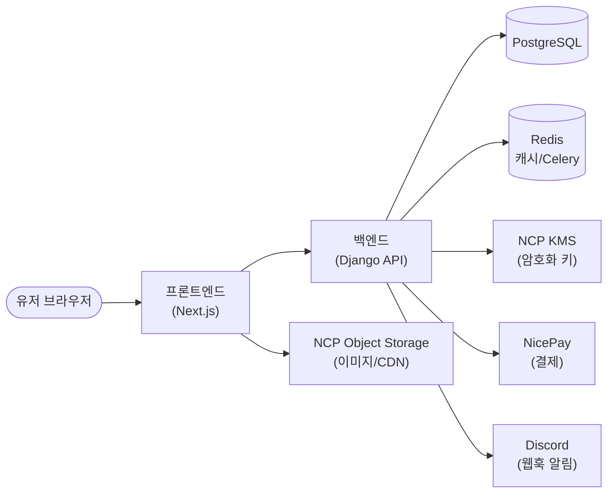

<Head
  title="아키텍처 개요"
  date="2026-04-14"
  description="프론트 모노레포 + 백엔드 Django 도메인 구조"
/>

## 레이어/도메인 매트릭스

<MatrixTable
  columns={[
    "계정/인증",
    "원가계산",
    "외부 식자재 연동",
    "손익관리",
    "결제/플랜",
    "온보딩/가이드",
    "공지/고지",
    "관리자 콘솔",
    "보안/추적",
  ]}
  rows={[
    {
      label: "시스템",
      values: [
        "Django Auth, 세션/쿠키, 권한",
        "—",
        "—",
        "—",
        "이메일 알림, NicePay 게이트웨이",
        "—",
        "—",
        "Django Admin, 커스텀 Admin 프레임워크",
        "로깅 인프라, 감사 로그",
      ],
    },
    {
      label: "데이터",
      values: [
        "User, Profile",
        "Store, Ingredient, Supply, Recipe, Prep, Menu, Item",
        "MaterialSource, 외부 카탈로그",
        "Finance 스냅샷, MenuSales, MenuAnalysis",
        "Payment, Subscription, Plan, Promotion",
        "OnboardingState, SampleStore, TourProgress",
        "Notice, LegalDoc",
        "AdminLog, ElsaLog, DataExplorer 쿼리",
        "TrackingEvent, SecurityAudit",
      ],
    },
    {
      label: "비즈니스 로직",
      values: [
        "회원가입/탈퇴 플로우, 권한 검사",
        "식자재 단가 환산, 레시피·prep·메뉴 원가 집계",
        "외부 소스 동기화, 단가 매핑",
        "손익 집계, 판매량 분석",
        "플랜 만료 판정, 프로모션 할인, 결제 후 플랜 활성화",
        "온보딩 단계 진행, 샘플 데이터 주입",
        "공지 노출 규칙",
        "데이터 조회/집계, 로그 필터링",
        "이벤트 추적 규칙, 이상 탐지",
      ],
    },
    {
      label: "인터페이스",
      values: [
        "로그인, 회원가입, 마이페이지",
        "레시피 편집, 메뉴 원가, 식자재·부자재 목록, prep",
        "외부 식자재 검색/연동 화면",
        "손익 대시보드, 메뉴 판매 분석",
        "결제 페이지, 플랜 선택, 프로모션 배너, 온보딩 플랜",
        "온보딩 위저드, 투어, 샘플 스토어, 테스터",
        "공지 배너, 약관 페이지",
        "Admin 앱 전체, 데이터 탐색기, Elsa 로그 뷰어",
        "(대부분 백그라운드)",
      ],
    },
  ]}
/>

## 전체 시스템 플로우

---

## 프론트엔드 레이어 구조

**Turborepo 모노레포** — `apps/` (실행 가능한 앱) + `packages/` (공유 패키지)

| 레이어        | 위치                   | 역할                                     |
| ------------- | ---------------------- | ---------------------------------------- |
| 라우팅        | `apps/client/src/app/` | Next.js App Router, page.tsx             |
| 페이지        | `features/*/page/`     | 진입점, 훅에서 데이터 받아 UI에 전달     |
| 비즈니스 로직 | `features/*/hook/`     | API 호출, 상태 관리, 계산 로직           |
| UI (표현)     | `features/*/ui/`       | props만 받아 렌더링, 비즈니스 로직 없음  |
| 서버 상태     | `packages/api/`        | TanStack React Query 훅 + Axios API 함수 |
| 전역 UI 상태  | `store/*.atom.ts`      | Jotai atoms                              |
| 공유 컴포넌트 | `packages/ui/`         | Shadcn/Radix 기반 컴포넌트 라이브러리    |
| 공유 타입     | `packages/types/`      | 프론트/백 공유 TypeScript 타입           |

### 앱별 역할

| 앱             | 포트 | 설명                                 |
| -------------- | ---- | ------------------------------------ |
| `apps/client/` | 3000 | 메인 유저 앱 (식자재·메뉴·원가 관리) |
| `apps/admin/`  | 3100 | 내부 운영팀 어드민 대시보드          |
| `apps/wiki/`   | 3200 | 내부 문서 사이트 (Astro)             |

---

## 백엔드 도메인 구조

**Django** — 기능별 앱으로 도메인 분리

| Django 앱     | 역할                                   |
| ------------- | -------------------------------------- |
| `users`       | 유저 생성, 인증(JWT), 소셜 로그인      |
| `stores`      | 매장 관리                              |
| `ingredients` | 식자재                                 |
| `supplies`    | 부자재                                 |
| `prep`        | 프렙 (반조리)                          |
| `menu`        | 메뉴                                   |
| `recipe`      | 레시피, 조리 매뉴얼                    |
| `finances`    | 매출 분석, 메뉴 판매 데이터            |
| `payments`    | 구독, 플랜, 결제 처리                  |
| `nicepay`     | NicePay 연동, 빌링키, PlanChangeEngine |
| `security`    | DEK 기반 필드 암호화                   |
| `console`     | 어드민 페이지 API                      |
| `common`      | 공통 유틸리티, 기본 모델               |

---

## 환경별 API 엔드포인트

| 환경    | URL                                   |
| ------- | ------------------------------------- |
| local   | `http://localhost:8000/`              |
| staging | `https://stagingapi.foodlogic.co.kr/` |
| prod    | `https://api.foodlogic.co.kr/`        |

환경 구분: `NEXT_PUBLIC_APP_ENV` 환경변수 → `apps/client/src/config/config.ts`
