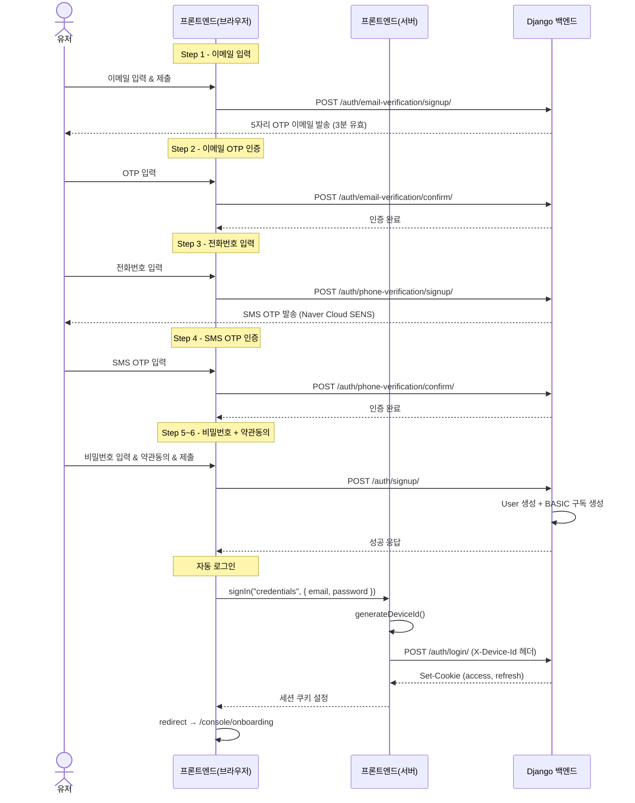
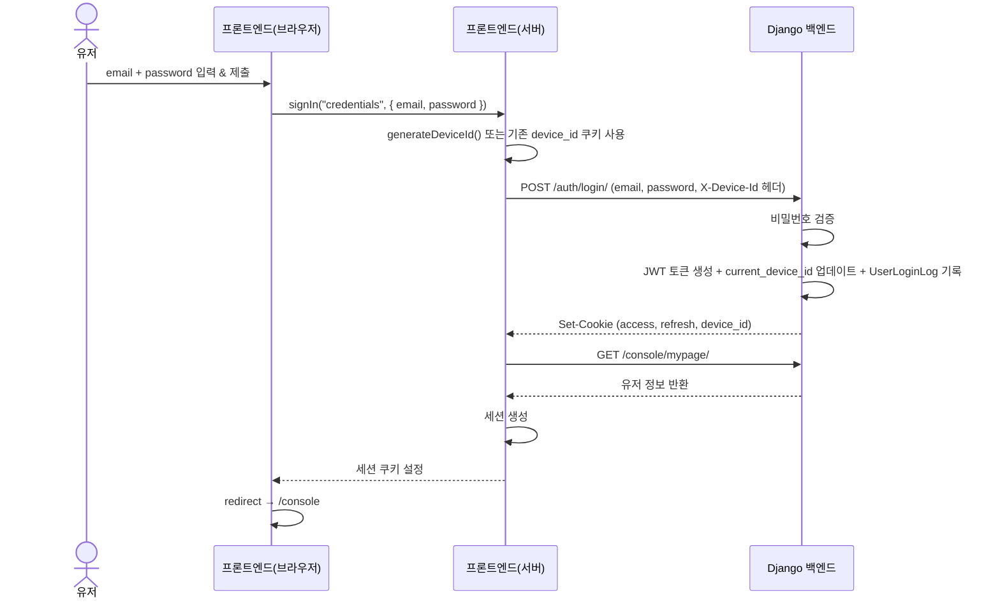
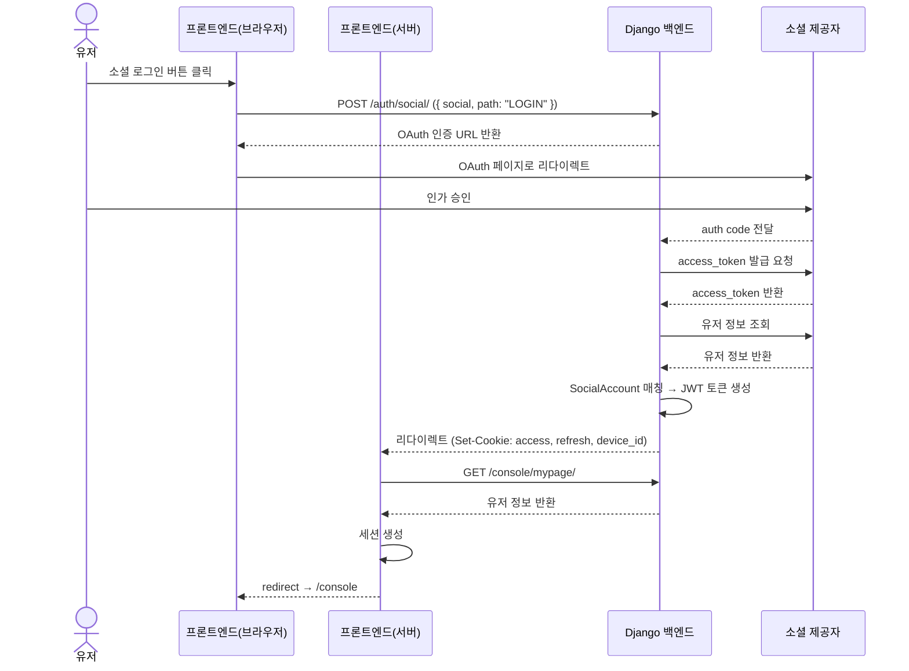

<Head title="계정/인증 시스템" date="2026-04-14" description="JWT 토큰 로테이션 + 단일 기기 로그인 + 이메일/소셜 인증" />

## 토큰 구조

| 항목 | 내용 |
|---|---|
| 발급 토큰 | Access Token (JWT) + Refresh Token (JWT) |
| Access Token 유효기간 | 30분 |
| Refresh Token 유효기간 | 14일 |
| 저장 방식 | HTTP-only 쿠키 (`secure=True`, `samesite=Lax`) |
| 토큰 갱신 | `POST /token/refresh/` → 새 Access + 새 Refresh (토큰 로테이션) |
| 비밀번호 해싱 | Argon2 |

### 보안 메커니즘

- **토큰 로테이션:** Refresh 시 기존 토큰 블랙리스트 처리 + 새 토큰 발급
- **동시성 보호:** Redis 락으로 refresh 토큰 race condition 방지
- **재사용 방지:** 5분 내 동일 토큰 재사용 캐시 체크
- **로그아웃:** refresh 토큰 블랙리스트 + Device ID 초기화

---

## Device ID (단일 기기 로그인)

로그인 시 `X-Device-Id` 헤더 값을 `User.current_device_id`에 저장합니다. 다른 기기에서 로그인하면 기존 Device ID가 교체되어 이전 기기는 강제 로그아웃됩니다.

---

## 이메일 회원가입 플로우

---

## 이메일 로그인 플로우

---

## 소셜 로그인 플로우 (Kakao / Naver / Google)

> 신규 유저(소셜 회원가입)의 경우 추가 정보 입력(전화번호 인증, 약관동의) 단계가 포함됩니다.
