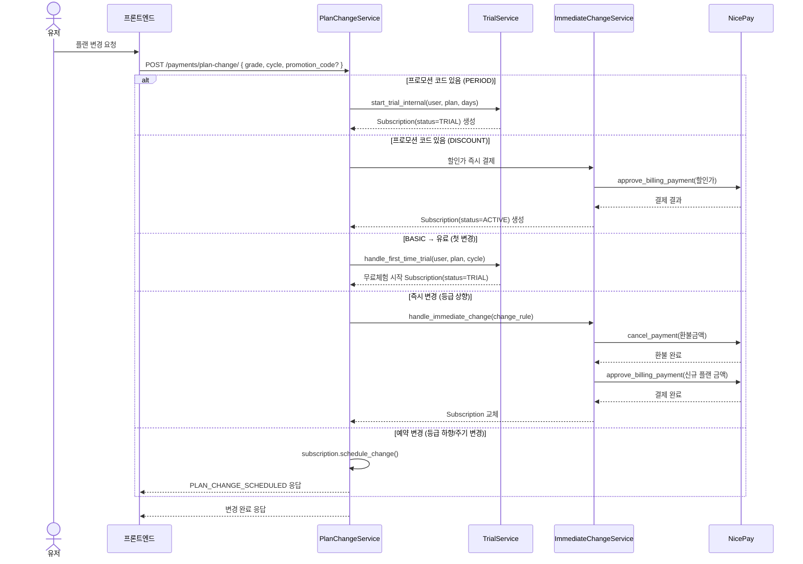
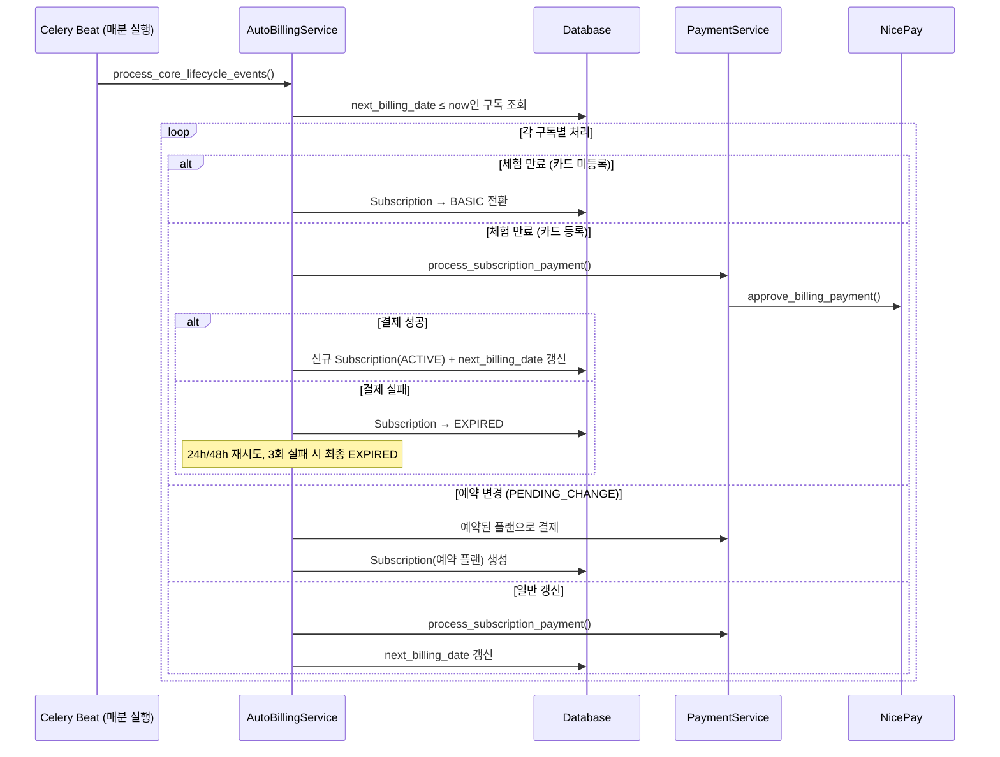

<Head
  title="결제/플랜 시스템"
  date="2026-04-14"
  description="NicePay 빌링키 방식 자동결제 + 플랜 변경/환불/프로모션"
/>

## 플랜 구조

| 등급     | 월간     | 연간      | 비고                |
| -------- | -------- | --------- | ------------------- |
| BASIC    | 0원      | —         | 기본 무료 플랜      |
| PRO      | 19,800원 | 178,200원 | 연간 정가 237,600원 |
| BUSINESS | 33,000원 | 297,000원 | 연간 정가 396,000원 |

### 플랜 상태

`active` / `trial` / `suspended` / `cancelled` / `expired` / `pending_change`

### 등급별 리소스 제한

| 항목        | BASIC | PRO | BUSINESS |
| ----------- | ----- | --- | -------- |
| 매장        | 1     | 3   | 10       |
| 식자재      | 50    | 500 | 1,500    |
| 부자재      | 5     | 100 | 300      |
| 프렙        | 10    | 50  | 150      |
| 메뉴        | 10    | 50  | 150      |
| 조리 매뉴얼 | 0     | 50  | 150      |

> 프론트와 백엔드에서 각각 관리
> 추후에 서버에서 플랜 권한 시스템을 통합해야함

---

## 프로모션 유형

| 유형     | 설명                                     |
| -------- | ---------------------------------------- |
| PERIOD   | N일 무료 체험 → 종료 시 정가 자동결제    |
| DISCOUNT | 즉시 할인 결제 → N회 할인 → 소진 후 정가 |
| MIXED    | N일 무료 → 할인 결제 → M회 할인 → 정가   |

할인 방식: `FLAT`(정액) / `RATE`(정률) / `FIXED_PRICE`(고정금액)

---

## 플랜 변경 규칙

> 버튼 문구는 제외하고, “지금 상태에서 무엇으로 바꾸는가” 기준으로 처리 방식을 분류합니다.

### 변경 상태 분류 기준

| 분류                | 판단 기준                                | 처리 원칙                                           |
| ------------------- | ---------------------------------------- | --------------------------------------------------- |
| 상향                | 등급이 올라감 (예: PRO → BUSINESS)       | 즉시 변경 + 필요 시 일할 환불/재결제                |
| 하향                | 등급이 내려감 (예: BUSINESS → PRO/BASIC) | 예약 변경 (다음 결제 주기 반영)                     |
| 동일 등급 주기 변경 | 같은 등급에서 월간↔연간 변경             | 예약 변경 (다음 결제 주기 반영)                     |
| 신규/재구독         | BASIC 또는 EXPIRED 상태에서 유료 시작    | 즉시 결제 후 활성화 (첫 유료 전환은 체험 정책 우선) |
| 체험 중 변경        | TRIAL 상태에서 플랜 변경                 | 즉시 변경 (환불 없음, 프로모션 규칙 우선)           |

### 현재 상태별 처리 표 (한눈에 보기)

| 현재 상태          | 변경 유형                        | 처리 시점 | 환불/금액 처리                            |
| ------------------ | -------------------------------- | --------- | ----------------------------------------- |
| BASIC              | 유료로 시작 (PRO/BUSINESS)       | 즉시      | 첫 변경 시 무료체험 우선, 그 외 즉시 과금 |
| PRO 월간           | 상향 (→ BUSINESS 월간/연간)      | 즉시      | 기존 결제분 일할 환불 후 신규 플랜 결제   |
| PRO 월간           | 동일 등급 주기 변경 (→ PRO 연간) | 예약      | 없음 (다음 주기부터 새 주기 적용)         |
| PRO 월간           | 하향 (→ BASIC)                   | 예약      | 없음                                      |
| PRO 연간           | 상향 (→ BUSINESS 월간/연간)      | 즉시      | 일할 환불 (연간→연간은 할인가 기준 환불)  |
| PRO 연간           | 동일 등급 주기 변경 (→ PRO 월간) | 예약      | 없음                                      |
| PRO 연간           | 하향 (→ BASIC)                   | 예약      | 없음                                      |
| BUSINESS 월간/연간 | 하향 (→ PRO/BASIC)               | 예약      | 없음                                      |
| BUSINESS 월간/연간 | 동일 등급 주기 변경 (월간↔연간)  | 예약      | 없음                                      |
| TRIAL              | 유료 변경/상향                   | 즉시      | 환불 없음 (체험/프로모션 혜택 소멸 가능)  |
| EXPIRED            | 유료 재시작 (PRO/BUSINESS)       | 즉시      | 신규 결제로 재활성화                      |
| EXPIRED            | BASIC 전환                       | 즉시      | 환불 없음                                 |

---

## 유저 결제 플로우

---

## 자동결제 플로우 (Celery Beat)

---

## 주의사항

- 결제 실패 시 BASIC 다운그레이드가 아닌 **EXPIRED 처리** (데이터 보존, 재결제 유도)
- 환불 금액은 **원래 결제 금액 기준** 일할 계산 (단, 연간→연간은 할인가 기준)
- **NicePay에서 직접 환불 금지** — 반드시 Admin 페이지에서 환불 (기록 유지 필수)
- 모든 결제/환불/실패는 **Discord 웹훅** 알림 발송
- `PlanManagementLog`로 모든 구독 상태 변화를 Admin에서 추적 가능

---

## 결제 서비스 모듈

| 서비스               | 역할                              |
| -------------------- | --------------------------------- |
| `BillingKeyService`  | 카드 등록/삭제                    |
| `PaymentService`     | 결제 실행 + 할인 반영             |
| `PaymentPageService` | 8가지 시나리오별 결제 페이지 응답 |
| `PromotionService`   | 프로모션 검증/적용                |
| `TrialService`       | 무료체험 시작/취소/연장           |
| `AutoBillingService` | 자동결제 + 갱신                   |
| `PlanChangeService`  | 플랜 변경 오케스트레이터          |
